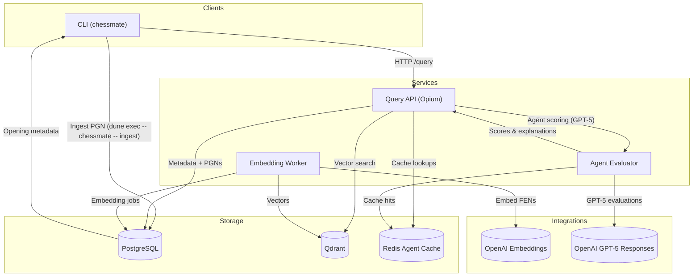
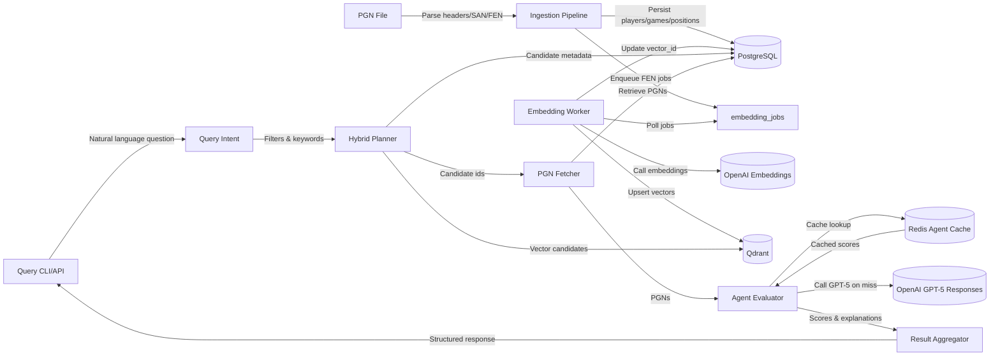
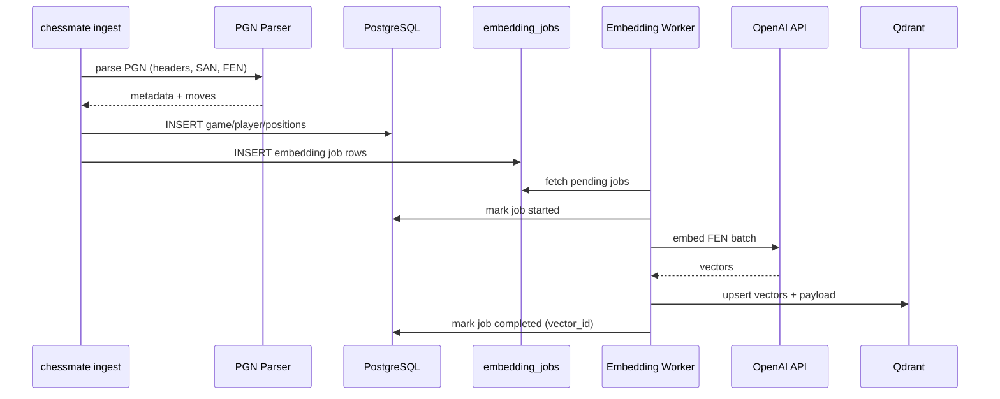
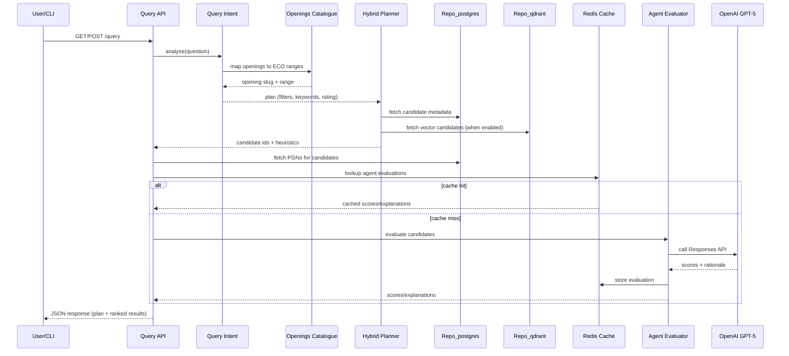
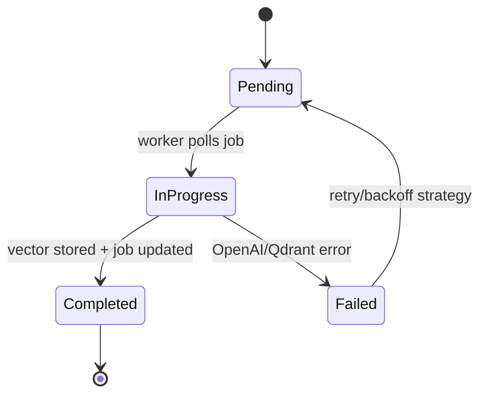
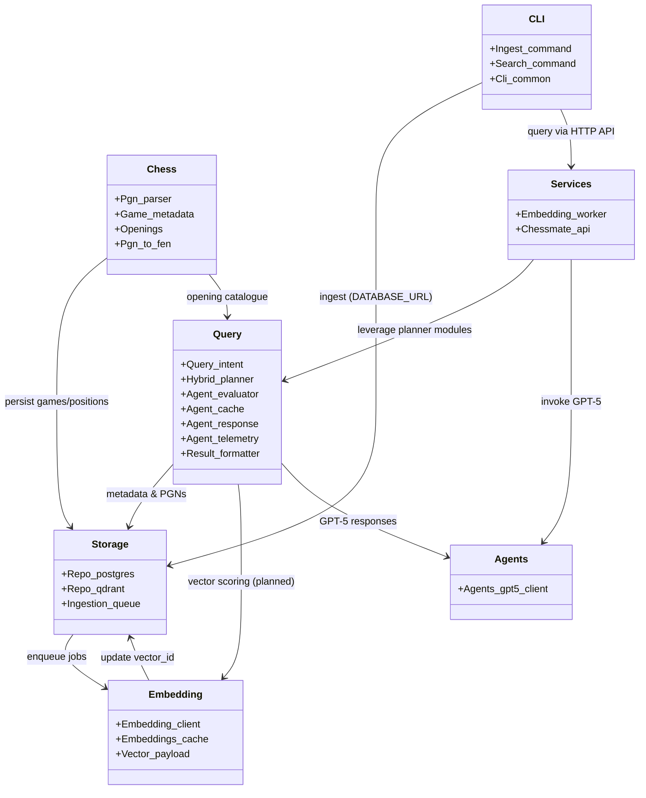
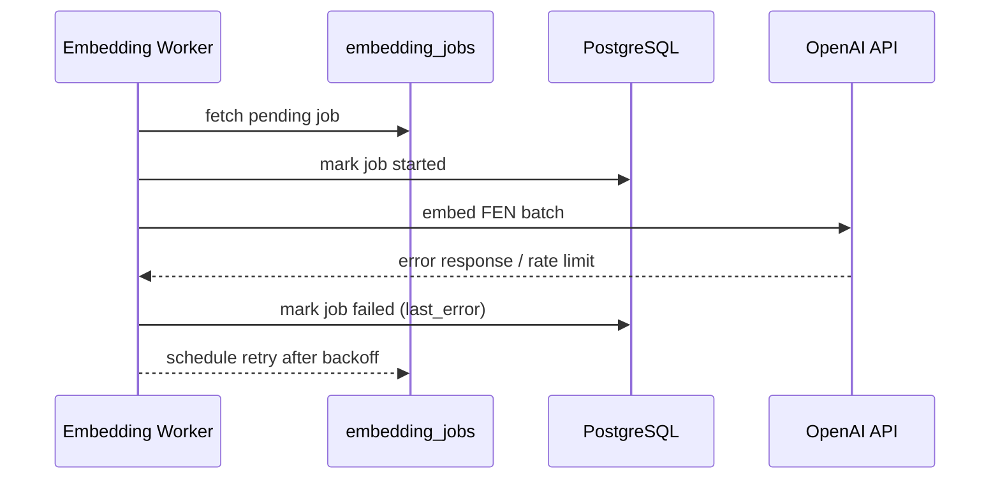
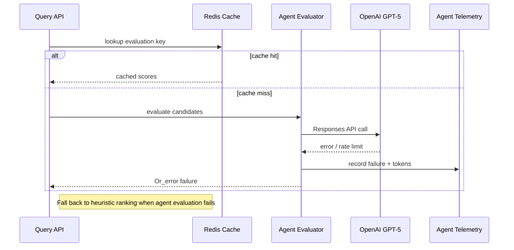

# Architecture Overview

## System Goals

### Related Documentation
- [Implementation Plan](IMPLEMENTATION_PLAN.md) – milestone roadmap and future phases.
- [Operations Playbook](OPERATIONS.md) – day-to-day service management and runtime procedures.
- [Chessmate for Dummies](CHESSMATE_FOR_DUMMIES.md) – narrative walkthrough of the same pipelines for non-engineers.
- [Developer Handbook](DEVELOPER.md) – onboarding, tooling, and local environment setup.

- Answer natural-language chess questions by combining structured metadata with vector similarity.
- Self-host PostgreSQL + Qdrant; rely on OpenAI only for embedding generation.
- Offer OCaml CLIs and HTTP services to support ingestion and retrieval workflows.

## Visual Overview

## Component Overview
- **CLI & API Layer**: `dune exec -- chessmate -- ingest` / `dune exec -- chessmate -- query` commands and the Opium-based `/query` service route user intent into the platform.
- **Ingestion pipeline** (`lib/chess/pgn_parser`, `lib/storage/repo_postgres`): parses PGNs, derives FEN snapshots, extracts ECO/opening metadata, persists games/positions/embedding jobs in Postgres, and now enforces a configurable guard to pause ingestion when the embedding queue is saturated.
- **Embedding pipeline** (`services/embedding_worker`): polls `embedding_jobs`, batches FEN strings, calls OpenAI embeddings, writes vectors to Qdrant, and records `vector_id` back in Postgres. Operators track throughput with `scripts/embedding_metrics.sh` while scaling workers via the `--workers` flag and rely on `CHESSMATE_MAX_PENDING_EMBEDDINGS` to keep ingest pressure in check.
- **Hybrid query pipeline** (`lib/query`, `lib/chess/openings`): turns natural-language questions into openings/ratings/keyword filters, queries Postgres (and Qdrant when configured), fetches PGNs, evaluates candidates via the GPT-5 agent with Redis caching (`Agent_evaluator`, `Agent_cache`, `Agents_gpt5_client`, `Agent_telemetry`), and assembles ranked responses.

## Data Flow

Detailed steps:
1. **Ingest**: PGN file → parse headers/SAN/FEN → extract player, result, ECO/opening slug → persist to Postgres (`games`, `players`, `positions`) → enqueue `embedding_jobs` for each FEN, with a guard on queue depth (`CHESSMATE_MAX_PENDING_EMBEDDINGS`) to keep backlog manageable.
2. **Embed**: Worker polls pending jobs → batches FENs → calls OpenAI embeddings → upserts into Qdrant (vector + payload) → updates Postgres `positions.vector_id` and job status.
3. **Query**: CLI/API receives question → `Query_intent.analyse` normalizes text, resolves opening synonyms via the ECO catalogue, and infers rating/phase filters → `Hybrid_planner` gathers metadata from Postgres (and Qdrant vectors when enabled) to produce candidate game ids → API fetches PGNs, checks the Redis-backed agent cache, and invokes GPT-5 for fresh evaluations when necessary → agent scores/explanations are merged with heuristic scores and formatted via `Result_formatter`.

## Storage Design
- **PostgreSQL**: `games` (players, ECO, opening_slug), `positions` (ply, fen, san, vector_id), `embedding_jobs`, `annotations` with indexes on ratings, ECO, opening slug, and vector_id.
- **Qdrant**: `positions` collection holding dense FEN embeddings and payload fields (player names, ECO range, move metadata) to support hybrid queries.
- **Redis**: agent evaluation cache storing GPT-5 scores/explanations keyed by the analysis plan + game id; backed by the `redis` service in Docker Compose.
- **Volumes**: `data/postgres`, `data/qdrant`, and `data/redis` mount persistent storage under Docker Compose for reproducible local environments.

## Module Boundaries
- `lib/chess`: PGN/FEN parsing, ECO/opening catalogue, domain metadata models.
- `lib/storage`: Postgres primitives (`Repo_postgres`), Qdrant adapter (`Repo_qdrant`), embedding queue helpers.
- `lib/embedding`: OpenAI embedding client, vector payload builders, and local embedding cache helpers.
- `lib/query`: intent parsing, hybrid planner, agent evaluator/cache/telemetry, result formatting.
- `lib/agents_gpt5_client`: GPT-5 Responses client with configurable effort/verbosity and retries.
- `lib/cli`: shared CLI glue + ingest/query subcommands.
- `services/`: standalone executables (embedding worker, API prototype).

## Service Responsibilities
- **Query API**: Opium HTTP service (`/query`) that parses intent, applies opening/rating filters, fetches metadata + PGNs from Postgres, optionally queries Qdrant, and re-ranks results via the GPT-5 agent with Redis-backed caching and telemetry. Upcoming work: enable live Qdrant re-ranking and expose richer metrics/health endpoints.
- **Embedding Worker**: long-running job consumer with retry/backoff, batching, and state transitions.
- **Background Jobs** (planned): re-embedding runs, data validation, analytics refresh pipelines.

## Sequence Diagrams
### Ingestion + Embedding

### Query Flow with Agent Evaluation

### Embedding Job State Transitions

### Module Relationships

## Component Deep Dive

### Query
- `lib/query/query_intent` performs deterministic text normalisation, ECO/opening lookup, rating extraction, and limit detection so the rest of the stack receives a stable `Query_intent.plan`.
- `lib/query/hybrid_planner` and `lib/query/hybrid_executor` translate the plan into SQL filters for `Repo_postgres`, optional payload filters for Qdrant, and scoring weights that blend deterministic keyword hits with (future) vector similarity. Until query embeddings ship, `query_vector` emits a reproducible placeholder derived from the cleaned text.
- `lib/query/agent_cache` and `lib/query/agent_evaluator` encapsulate GPT-5 calls, telemetry, and caching. Redis is preferred when `AGENT_CACHE_REDIS_URL` is set; otherwise an in-memory LRU keeps recent evaluations local to the process.
- `lib/query/result_formatter` assembles the final response payload, merging Postgres metadata, vector hits, and optional agent annotations. The formatter powers both the HTTP API JSON and the CLI tabular output.
- Failures at any layer bubble up as `Or_error.t`; the API and CLI log the sanitised error and fall back to heuristic ranking when the agent is unavailable.

### Pipeline (Ingestion)
- `lib/cli/ingest_command` orchestrates ingestion, reading PGNs from disk, scheduling parse/persist work through an Lwt pool sized by `CHESSMATE_INGEST_CONCURRENCY`, and short-circuiting when the embedding queue exceeds `CHESSMATE_MAX_PENDING_EMBEDDINGS`.
- Parsing is handled by `lib/chess/pgn_parser` and `lib/chess/pgn_to_fen`, which emit structured metadata, SAN moves, and per-ply FEN snapshots. `lib/chess/openings` maps headers and free-text to canonical ECO-based slugs.
- Persistence is the responsibility of `lib/storage/repo_postgres`, which inserts/updates players, games, and positions, and enqueues work in `embedding_jobs` through helpers in `lib/storage/ingestion_queue`.
- Each persisted position produces an `Embedding_job` row containing the FEN, game, ply, and payload context. Jobs remain pending until the worker claims them, keeping ingestion fast even without a running embedding worker.
- Errors surface early: malformed PGN input halts the run with a precise location, while database issues print sanitised diagnostics that point developers to migrations or connection problems.

### Embedding
- `lib/embedding/embedding_job` mirrors the database schema so both the CLI and worker share a consistent view of job state transitions.
- `lib/embedding/embedding_client` batches FEN strings, enforces `OPENAI_EMBEDDING_CHUNK_SIZE`/`OPENAI_EMBEDDING_MAX_CHARS`, and wraps OpenAI errors in `Or_error.t` values to keep callers in control.
- `lib/embedding/vector_payload` prepares the JSON payload inserted into Qdrant, combining metadata pulled from Postgres with derived fields such as the deterministic `vector_id`.
- `lib/embedding/embeddings_cache` provides a pluggable on-disk cache (useful for tests and rate-limit scenarios) so repeated embeddings avoid extra API calls.
- `services/embedding_worker/embedding_worker.ml` stitches these pieces together: it polls `Repo_postgres.claim_pending_jobs`, streams batches through `Embedding_client`, retries Qdrant upserts with exponential backoff, and writes completion/failure markers (`mark_job_completed`, `mark_job_failed`) for observability.

### CLI
- `lib/cli/cli_common` hosts shared option parsing, environment validation, and pretty-print helpers used by every subcommand. It ensures variables such as `DATABASE_URL` and `CHESSMATE_API_URL` are populated before work starts.
- `lib/cli/ingest_command`, `lib/cli/search_command`, and `lib/cli/pgn_to_fen_command` expose the primary workflows (ingest PGNs, query the API, inspect FENs). Each command returns `Or_error.t` so the binary can print a concise failure message and exit with the right status code.
- `lib/cli/twic_precheck_command` runs fast schema sanity checks against TWIC drops, flagging malformed headers before they reach the main ingestion loop.
- The executable in `bin/chessmate.ml` wires these modules into a Cmdliner-based CLI, leaving `lib/cli` reusable from tests and services.

### Services
- `services/api/chessmate_api.ml` is an Opium application exposing `/query`. It lazily initialises `Repo_postgres`, Qdrant access, and the optional GPT-5 agent client from `Config.Api`, logging a single `[config]` line at startup for auditing.
- Requests run through the query stack: intent analysis, hybrid planning/execution, Postgres fetches, optional Redis/in-memory cache lookups, agent evaluation, and final JSON formatting via `Result.to_json`. Errors surface as JSON with both human-readable and structured fields so clients can react programmatically.
- The API emits structured stdout/stderr lines (prefixed with `[chessmate-api]`) covering configuration, cache mode, and agent status; planned metrics hooks reuse the same configuration object.
- `services/embedding_worker/embedding_worker.ml` (documented above) can run as a long-lived daemon (`--workers`, `--poll-sleep`) or in batch mode via exit conditions. It shares configuration loading with the CLI, so pointing it at staging/production only requires environment variables.
- Both services lean on `Config` modules under `lib/` for environment decoding, making them hermetic and testable without side effects.

### Failure Path Example (Embedding Error)

### Failure Path Example (Agent Evaluation Error)

## External Integrations
- OpenAI embeddings API (ingestion/worker).
- OpenAI GPT-5 Responses API (agent evaluator with controllable reasoning effort).
- Qdrant HTTP/gRPC endpoints (vectors written today; query-side reads land in Milestone 6).
- Observability: structured logging, basic `/metrics` gauges (db_pool_*), and a load-testing harness; expanding histogram/counter coverage remains on the roadmap.

## Future Enhancements
- Phase 2: replace heuristic planner with live Postgres/Qdrant hybrid search (RRF, payload filters, vector re-ranking).
- Intent upgrades: expand opening catalogue, consider LLM-assisted classification with deterministic fallbacks.
- Agent maturity: richer caching metrics, configurable TTL policies, and dashboards for cost/latency outliers.
- Deployment hardening: containerize API/worker, add CI integration tests, explore Kubernetes/Nomad rollouts.
