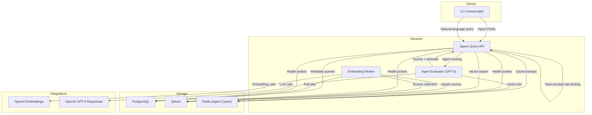

# Architecture Overview

Chessmate is a self-hosted chess tutor that ingests PGNs, stores structured metadata in PostgreSQL, indexes positions in Qdrant, and answers natural-language questions via a hybrid query pipeline that blends deterministic filters with vector search and optional GPT‑5 re-ranking.

---

## High-Level Goals
- Keep all storage under the operator’s control (Postgres, Qdrant, Redis) while using OpenAI only for embedding generation and optional agent scoring.
- Provide both CLI and HTTP interfaces for ingestion, diagnostics, and question answering.
- Support deterministic retrieval first (openings/ratings/keywords) with vector search and LLM scoring layered on top.
- Maintain strong observability (metrics, logs, health checks) and harden the API with rate limiting and bootstrap checks.

### Related Documentation
- [Developer Handbook](DEVELOPER.md) – environment setup, CLI usage, configuration reference.
- [Operations Playbook](OPERATIONS.md) – deployment, monitoring, incident response.
- [Testing Plan](TESTING.md) – manual checklists and automation guidance.
- [Review & Improvement Plan](REVIEW_v4.md) – roadmap and outstanding gaps.

---

## System Diagram



**Key guarantees**
- API enforces per-IP rate limits and auto-creates the Qdrant collection at startup.
- CLI health checks and `/health` endpoints verify Postgres, Qdrant, Redis, and (planned) OpenAI connectivity.
- All SQL uses Caqti (parameterised queries) and sensitive strings are sanitised before logging.

---

## Component Overview

### CLI
- `chessmate ingest <pgn>`: parses PGNs, persists games/positions/embedding jobs in Postgres, respecting queue guard (`CHESSMATE_MAX_PENDING_EMBEDDINGS`).
- `chessmate query [--json] <question>`: performs health checks, rate-limit enforcement, and issues HTTP queries to `/query`.
- Additional commands: `fen`, `twic-precheck`, diagnostics helpers.
- Shared helpers live under `lib/cli` (environment parsing, pretty-printing).

### Query API (Opium)
- Exposes `/query`, `/health`, `/metrics`, `/openapi.yaml`.
- Rate-limiter middleware (`lib/api/rate_limiter`) enforces per-IP quotas with `Retry-After` headers and Prometheus counters.
- Handles intent parsing (`lib/query/query_intent`), hybrid planning/execution (`lib/query/hybrid_planner`, `lib/query/hybrid_executor`), agent evaluation, and response formatting.`
- Uses `Repo_postgres` for metadata fetches and `Repo_qdrant` for vector search.
- Lazily initialises GPT-5 client/cache, supporting Redis or in-memory LRU.

### Embedding Worker
- Polls `embedding_jobs`, batches FEN strings, calls OpenAI embeddings, upserts vectors into Qdrant, and marks jobs complete/failure in Postgres.
- Respects `--workers`, `--poll-sleep`, `--exit-after-empty` flags; logs structured metrics.
- On startup ensures the Qdrant collection exists using `Repo_qdrant.ensure_collection`.

### Storage Components
- **PostgreSQL** (via Caqti) stores players, games, positions (with FEN/SAN/vector_id), embedding_jobs, annotations.
- **Qdrant** stores vector embeddings plus metadata payloads (players, ECO, themes). Collection name/size/distance are configurable.
- **Redis** (optional) caches GPT-5 evaluations keyed by query plan + game ID.

### External Integrations
- **OpenAI Embeddings**: used solely for FEN embeddings during ingestion/workers.
- **OpenAI GPT-5**: optional re-ranking step; agent usage is cached and configurable via effort/verbosity env vars.

---

## Data Flow Summary

### Ingestion
1. CLI reads PGN, parses headers/SAN/FEN (`lib/chess/pgn_parser`, `lib/chess/pgn_to_fen`).
2. Extracted metadata persisted via `Repo_postgres` (players, games, positions) and jobs enqueued in `embedding_jobs`.
3. Worker claims jobs, embeds batches via `Embedding_client`, upserts into Qdrant (`Repo_qdrant.upsert_points`), records `vector_id`, and updates job status.

### Query
1. CLI/API receives textual question; rate limiter checks quota (429 on violation). Health checks run before remote calls.
2. `Query_intent.analyse` normalises text, extracts keywords/opening filters, rating ranges, and result limit.
3. `Hybrid_planner` builds SQL predicates and optional Qdrant filters; `Hybrid_executor` fetches metadata from Postgres and vector candidates from Qdrant.
4. Redis cache consulted for agent evaluations. On miss, GPT-5 is invoked (`Agents_gpt5_client.evaluate`); results cached and telemetry logged.
5. `Result_formatter` merges heuristic and agent scores into JSON payload/CLI summary.

### Observability & Health
- `/metrics` exposes Caqti pool gauges and rate limiter counters; upcoming work adds per-dependency health metrics.
- `/health` (planned extension) will return structured JSON indicating dependency status (Postgres, Qdrant, Redis, OpenAI).
- CLI health command reuses probe logic to validate local environments before queries.

---

## Module Boundaries (Selected)
- `lib/chess/*`: parsing, FEN/opening catalogue, domain models.
- `lib/storage/*`: Postgres (`Repo_postgres`), Qdrant (`Repo_qdrant`), embedding queue helpers.
- `lib/embedding/*`: OpenAI client, local cache, payload builders.
- `lib/query/*`: intent parsing, hybrid planner/executor, agent cache/evaluator, result formatting.
- `lib/api/rate_limiter`: token-bucket implementation with metrics support.
- `lib/cli/*`: CLI commands and shared tooling.
- `services/api` & `services/embedding_worker`: entry points for HTTP API and background worker.

---

## Current Reliability Features
- **Rate limiting**: configurable per-IP quotas with `Retry-After` responses.
- **Qdrant bootstrap**: ensures target collection exists with expected schema on startup.
- **Secret sanitisation**: sensitive strings redacted from logs/errors.
- **Health checks**: CLI verifies dependencies before query; API `/metrics` surfaces pool/rate-limiter counters (deeper `/health` JSON planned).
- **Telemetry**: GPT-5 agent logs structured usage (latency, tokens, cost) and metrics; load-testing script integrates Prometheus snapshots.

---

## Roadmap Snapshot
Refer to [docs/REVIEW_v4.md](REVIEW_v4.md) for the detailed roadmap. Critical next steps:
- Deep health checks (structured `/health`, dependency probes, worker health endpoint).
- Agent evaluation timeout/circuit breaker with fallback warnings and metrics.
- Expanded Prometheus instrumentation (request latency, error rates, cache statistics).
- Query pagination and richer client controls.

---

## Quick Commands
```sh
# Format & test
dune fmt
dune build && dune runtest

# Run API (port 8080) and worker
dune exec -- services/api/chessmate_api.exe --port 8080
OPENAI_API_KEY=dummy dune exec embedding_worker -- --workers 2 --poll-sleep 1.0

# Issue a query (JSON mode)
CHESSMATE_API_URL=http://localhost:8080 dune exec -- chessmate -- query --json "Show 5 random games"
```

---

Chessmate keeps ingestion, vector search, and agent scoring under your control while mixing classic chess heuristics with modern LLM-assisted retrieval. This document should orient new contributors and operators; see the linked guides for deeper dive sections.
