# Implementation Plan

## Objectives & Scope
- Build a self-hosted chess tutor (“chessmate”) that answers natural-language questions by combining structured metadata with position similarity.
- Use PostgreSQL for canonical PGN storage, Qdrant for vector embeddings, OpenAI for embedding generation.
- Ship OCaml tooling: ingestion/query CLIs, shared libraries, embedding worker, and HTTP API for hybrid search.

## Current Status Snapshot
| Milestone | Status | Notes |
|-----------|--------|-------|
| 1 – Repository scaffolding | ✅ complete | Baseline structure, Alcotest smoke tests, CLI stubs.
| 2 – Data ingestion foundations | ✅ complete | Real PGN parser, migrations, `chessmate ingest` wired to Postgres.
| 3 – Embedding pipeline | ✅ complete | Jobs persisted, embedding worker loops, vector IDs recorded.
| 4 – Hybrid query prototype | ✅ complete | Intent heuristics, `/query` API, CLI integration, ECO catalogue.
| 5 – Evaluation & observability | 🚧 pending | Harness, metrics, CI hardening, containerized services.

## Architecture Overview
```mermaid
graph TD
  subgraph Clients
    CLI[CLI (chessmate)]
  end
  subgraph Services
    API[Query API (Opium)]
    Worker[Embedding Worker]
  end
  subgraph Storage
    PG[(PostgreSQL)]
    QD[(Qdrant)]
  end
  subgraph Integrations
    OpenAI[(OpenAI Embeddings)]
  end

  CLI -- "HTTP /query" --> API
  CLI -- "Ingest PGN" --> PG
  API -- "Metadata lookups" --> PG
  API -- "Vector search" --> QD
  Worker -- "Embedding jobs" --> PG
  Worker -- "Vectors" --> QD
  Worker -- "Embed FENs" --> OpenAI
```

## Data Model Plan
- `games`: PGN text, ECO, opening slug, event/site/date, players, ratings, result, tags.
- `players`: name, aliases/FIDE IDs, rating peaks.
- `positions`: game_id, ply, FEN, SAN, eval, `vector_id`, JSON tags, timestamps.
- `embedding_jobs`: status machine (`pending`, `in_progress`, `completed`, `failed`), FEN payload.
- Indexes: B-tree for ratings, eco/opening slug, job status; GIN/trgm for textual search.
- Qdrant payload mirrors key filters (opening, players, move metadata).

## Library Structure (`lib/`)
- `chess/`: PGN parser, game metadata, FEN engine, ECO catalogue (`openings`).
- `storage/`: `Repo_postgres`, queue helpers, Qdrant adapter (future).
- `embedding/`: OpenAI client stubs, caching (planned), payload builders.
- `query/`: intent heuristics, hybrid planner scaffold, result formatter.
- `cli/`: ingest/query commands, shared env helpers.

## Services & Workflows
### Ingestion / Embedding Flow


### Query Flow (Prototype)

```mermaid
sequenceDiagram
  participant User as User/CLI
  participant API as Query API
  participant Intent as Query Intent
  participant Catalog as Openings Catalogue
  participant Planner as Hybrid Planner

  User->>API: GET/POST /query
  API->>Intent: analyse(question)
  Intent->>Catalog: lookup opening synonyms → ECO ranges
  Catalog-->>Intent: opening slug/range
  Intent-->>Planner: filters, rating, keywords
  Planner-->>API: curated results (prototype dataset)
  API-->>User: JSON response
```

Future work: Planner hits live Postgres/Qdrant for hybrid scoring.

## Testing Strategy
- Unit tests (Alcotest) for PGN parser, metadata extraction, query intent heuristics.
- Integration tests (future) against Dockerized Postgres/Qdrant for ingest/query pipelines.
- Regression suite of NL queries once the live hybrid planner ships.
- CI (GitHub Actions) runs `dune build`, `dune runtest` on pushes/PRs.

## Deployment & Operations Snapshot
- Docker Compose stack (local dev): Postgres + Qdrant, volumes under `data/postgres`, `data/qdrant`.
- Run migrations via `./scripts/migrate.sh` (idempotent); CLI commands rely on `DATABASE_URL` / `CHESSMATE_API_URL`.
- Embedding worker & API currently run via `dune exec`; containerization slated for milestone 5.
- Backups: `pg_dump` + WAL archiving, Qdrant snapshots stored securely.
- Observability (planned): structured logs, Prometheus metrics, health endpoints.
- Security: guardrails include TLS terminator, Qdrant auth, least-privilege DB roles, API keys.

## Milestones & Checkpoints
### Milestone 1 – Repository Scaffolding (✅)
**Objective:** Establish project skeleton, build system, initial tests.
- Tasks: scaffold modules, add Alcotest smoke tests, set up CLI stubs, ensure `dune build`.
- Checkpoints: `dune build`, `dune fmt --check`, `dune test` pass; directory layout matches plan.

### Milestone 2 – Data Ingestion Foundations (✅)
**Objective:** Parse PGNs, persist metadata, expose schema migrations.
- Tasks: replace PGN parser with real extraction, add migrations/seeds, build `chessmate ingest`.
- Checkpoints: ingest sample PGN → Postgres populated; `SELECT count(*) FROM positions` matches expectation; integration test validates round-trip.

### Milestone 3 – Embedding Pipeline (✅)
**Objective:** Generate embeddings, sync Qdrant with Postgres.
- Tasks: implement embedding client (retries/throttle), payload builder, `embedding_worker` service, CLI enqueue path.
- Checkpoints: Docker stack brings up Postgres/Qdrant; worker inserts vectors; Postgres rows receive `vector_id`; Qdrant payload contains metadata.

### Milestone 4 – Hybrid Query Prototype (✅)
**Objective:** Answer NL questions via heuristic hybrid pipeline.
- Tasks: upgrade `Query_intent` heuristics (openings, ratings, keywords), add `/query` Opium API, wire `chessmate query` CLI, seed ECO catalogue.
- Checkpoints: CLI returns ranked responses with filters; unit tests cover intent edge cases; docs updated (README, architecture, operations).

### Milestone 5 – Evaluation & Observability (🚧)
**Objective:** Validate answer quality, prepare for production.
- Tasks: integrate live Postgres + Qdrant planner, build evaluation harness with curated NL queries, instrument API/worker with metrics & `/metrics`, containerize API/worker, add CI integration suite that spins up the stack and runs smoke queries.
- Checkpoints: evaluation report with thresholds; Prometheus metrics exposed; integration tests hit live stack; container images published.

## Progress Log
- **Milestone 1:** baseline directory structure, modules, Alcotest smoke test. `dune build`/`dune test` green.
- **Milestone 2:** PGN parser, migrations/seed scripts, `chessmate ingest` populates Postgres.
- **Milestone 3:** embedding jobs persisted, worker loops embedding FENs via OpenAI, vector IDs stored; `chessmate fen` diagnostic command added.
- **Milestone 4:** heuristic query planner, `/query` API prototype, CLI integration, ECO catalogue (`lib/chess/openings`), opening metadata persisted (`opening_name/opening_slug`).
- **Next:** wire planner to live Postgres/Qdrant (replace curated dataset in `/query`), build evaluation harness + metrics, containerize API/worker and extend CI with integration tests.
