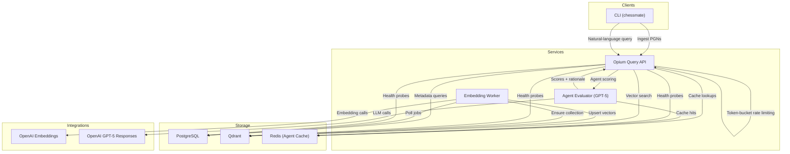

# Architecture Overview

Chessmate is a self-hosted chess tutor that ingests PGNs, stores structured metadata in PostgreSQL, indexes positions in Qdrant, and answers natural-language questions via a hybrid query pipeline that blends deterministic filters with vector search and optional GPT‑5 re-ranking.

---

## High-Level Goals
- Keep all storage under the operator’s control (Postgres, Qdrant, Redis) while using OpenAI only for embedding generation and optional agent scoring.
- Provide both CLI and HTTP interfaces for ingestion, diagnostics, and question answering.
- Support deterministic retrieval first (openings/ratings/keywords) with vector search and LLM scoring layered on top.
- Maintain strong observability (metrics, logs, health checks) and harden the API with rate limiting and bootstrap checks.

### Related Documentation
- [Developer Handbook](DEVELOPER.md) – environment setup, CLI usage, configuration reference.
- [Operations Playbook](OPERATIONS.md) – deployment, monitoring, incident response.
- [Testing Plan](TESTING.md) – manual checklists and automation guidance.
- [Release Notes](../../RELEASE_NOTES.md) – shipped capabilities and upcoming milestones.

---

## System Diagram



**Key guarantees**
- API enforces per-IP rate limits, request body guards, and auto-creates the Qdrant collection at startup.
- CLI health output and `/health` endpoints (API + worker) verify Postgres, Qdrant, Redis, and OpenAI integrations with per-check latency.
- All SQL uses Caqti (parameterised queries) and sensitive strings are sanitised before logging.

---

## Component Overview

### CLI
- `chessmate ingest <pgn>`: parses PGNs, persists games/positions/embedding jobs in Postgres, respecting queue guard (`CHESSMATE_MAX_PENDING_EMBEDDINGS`).
- `chessmate query [--json] <question>`: performs health checks, rate-limit enforcement, and issues HTTP queries to `/query`.
- `chessmate collection snapshot|restore|list`: orchestrates Qdrant snapshots and logs metadata locally for reproducible rollback/reindex workflows.
- Additional commands: `fen`, `twic-precheck`, diagnostics helpers.
- Shared helpers live under `lib/cli` (environment parsing, pretty-printing).

### Query API (Opium)
- Exposes `/query`, `/health`, `/metrics`, `/openapi.yaml`.
- Rate-limiter middleware (`lib/api/rate_limiter`) enforces per-IP quotas with `Retry-After` headers and Prometheus counters.
- Handles intent parsing (`lib/query/query_intent`), hybrid planning/execution (`lib/query/hybrid_planner`, `lib/query/hybrid_executor`), agent evaluation, and response formatting.`
- Uses `Repo_postgres` for metadata fetches and `Repo_qdrant` for vector search.
- Lazily initialises GPT-5 client/cache, supporting Redis or in-memory LRU.

### Embedding Worker
- Polls `embedding_jobs`, batches FEN strings, calls OpenAI embeddings, upserts vectors into Qdrant, and marks jobs complete/failure in Postgres.
- Respects `--workers`, `--poll-sleep`, `--exit-after-empty` flags; logs structured metrics.
- On startup ensures the Qdrant collection exists using `Repo_qdrant.ensure_collection`.

### Storage Components
- **PostgreSQL** (via Caqti) stores players, games, positions (with FEN/SAN/vector_id), embedding_jobs, annotations.
- **Qdrant** stores vector embeddings plus metadata payloads (players, ECO, themes). Collection name/size/distance are configurable.
- **Redis** (optional) caches GPT-5 evaluations keyed by query plan + game ID.

### External Integrations
- **OpenAI Embeddings**: used solely for FEN embeddings during ingestion/workers.
- **OpenAI GPT-5**: optional re-ranking step; agent usage is cached and configurable via effort/verbosity env vars.

---

## Data Flow Summary

### Ingestion
1. CLI reads PGN, parses headers/SAN/FEN (`lib/chess/pgn_parser`, `lib/chess/pgn_to_fen`).
2. Extracted metadata persisted via `Repo_postgres` (players, games, positions) and jobs enqueued in `embedding_jobs`.
3. Worker claims jobs, embeds batches via `Embedding_client`, upserts into Qdrant (`Repo_qdrant.upsert_points`), records `vector_id`, and updates job status.

### Query
1. CLI/API receives textual question; rate limiter checks quota (429 on violation). Health checks run before remote calls.
2. `Query_intent.analyse` normalises text, extracts keywords/opening filters, rating ranges, and result limit.
3. `Hybrid_planner` builds SQL predicates and optional Qdrant filters; `Hybrid_executor` fetches metadata from Postgres and vector candidates from Qdrant.
4. Redis cache consulted for agent evaluations. On miss, GPT-5 is invoked (`Agents_gpt5_client.evaluate`); results cached and telemetry logged.
5. `Result_formatter` merges heuristic and agent scores into the JSON payload/CLI summary, including pagination metadata (`limit`, `offset`, `total`, `has_more`).

### Observability & Health
- `/metrics` now publishes per-route request counters/latency histograms, Postgres pool gauges (capacity/in-use/available/waiting + wait ratio), agent cache and evaluation counters, and the agent circuit-breaker state. Rate-limiter counters and optional CLI/worker exporters reuse the same registry so dashboards stay aligned across processes.
- `/health` returns structured JSON with `status=ok|degraded|error`, per-check latency, and sanitized detail for Postgres, Qdrant, Redis, and OpenAI. The embedding worker exposes the identical schema on `http://localhost:${CHESSMATE_WORKER_HEALTH_PORT:-8081}/health`.
- Probes exercise live connectivity: Postgres connection/pending jobs, Qdrant `/healthz`, Redis `PING` (when configured), OpenAI client instantiation, and embedding endpoint verification for the worker.
- The CLI prints `[health] ...` lines before commands such as `query`, surfacing the same probe results in operator workflows. Failures bubble up to metrics and logs for alerting.
- Alerts watch degraded/error health responses alongside Prometheus series like `chessmate_api_db_pool_wait_ratio`, `chessmate_api_requests_total`, agent evaluation failures, and rate-limiter saturation.

### GPT-5 Timeout & Circuit Breaker
- **Request timeout**: `AGENT_REQUEST_TIMEOUT_SECONDS` bounds GPT-5 calls; on timeout the executor falls back to heuristic scoring and surfaces structured warnings in JSON/CLI output.
- **Circuit breaker**: `AGENT_CIRCUIT_BREAKER_THRESHOLD` and `AGENT_CIRCUIT_BREAKER_COOLOFF_SECONDS` gate retries after repeated failures. The breaker state is exported via `agent_circuit_breaker_state` and mirrored in logs.
- **Caching**: Redis or in-memory caches short-circuit repeat evaluations; cache hits/misses increment `agent_cache_total{state}`.
- **Telemetry**: `agent_evaluations_total{outcome}`, `agent_evaluation_latency_seconds`, and warning lists emitted by `Hybrid_executor` describe agent health. Logs include `[agent-telemetry]` records with latency, tokens, and cost estimates.

---

## Module Boundaries (Selected)
- `lib/chess/*`: parsing, FEN/opening catalogue, domain models.
- `lib/storage/*`: Postgres (`Repo_postgres`), Qdrant (`Repo_qdrant`), embedding queue helpers.
- `lib/embedding/*`: OpenAI client, local cache, payload builders.
- `lib/query/*`: intent parsing, hybrid planner/executor, agent cache/evaluator, result formatting.
- `lib/api/rate_limiter`: token-bucket implementation with metrics support.
- `lib/cli/*`: CLI commands and shared tooling.
- `services/api` & `services/embedding_worker`: entry points for HTTP API and background worker.

---

## Current Reliability Features
- **Rate limiting**: configurable per-IP quotas with `Retry-After` responses.
- **Qdrant bootstrap**: ensures target collection exists with expected schema on startup.
- **Secret sanitisation**: sensitive strings redacted from logs/errors.
- **Health checks**: CLI verifies dependencies before queries and the API/worker expose `/health` JSON with per-check latency plus sanitized detail for Postgres, Qdrant, Redis, and OpenAI.
- **Telemetry**: GPT-5 agent logs structured usage (latency, tokens, cost) while metrics cover request durations, agent cache/evaluations, circuit-breaker state, and rate-limiter counters; `scripts/load_test.sh` captures `/metrics` + `docker stats` snapshots for regression tracking.

---

## Roadmap Snapshot
Track near-term planning via [Release Notes](../../RELEASE_NOTES.md) and the GitHub issue tracker. Current focus areas:
- Broader query controls (structured filters, richer pagination ergonomics, result sorting).
- Extended observability (runtime-events export, proactive alerting around agent behaviour and queue depth).
- Operational automation (snapshot scheduling helpers, repeatable load/regression harnesses baked into CI).

---

## Quick Commands
```sh
# Format & test
dune fmt
dune build && dune runtest

# Run API (port 8080) and worker
dune exec -- chessmate-api -- --port 8080
OPENAI_API_KEY=dummy dune exec embedding_worker -- --workers 2 --poll-sleep 1.0

# Issue a query (JSON mode)
CHESSMATE_API_URL=http://localhost:8080 dune exec -- chessmate -- query --json "Show 5 random games"
```

---

Chessmate keeps ingestion, vector search, and agent scoring under your control while mixing classic chess heuristics with modern LLM-assisted retrieval. This document should orient new contributors and operators; see the linked guides for deeper dive sections.
